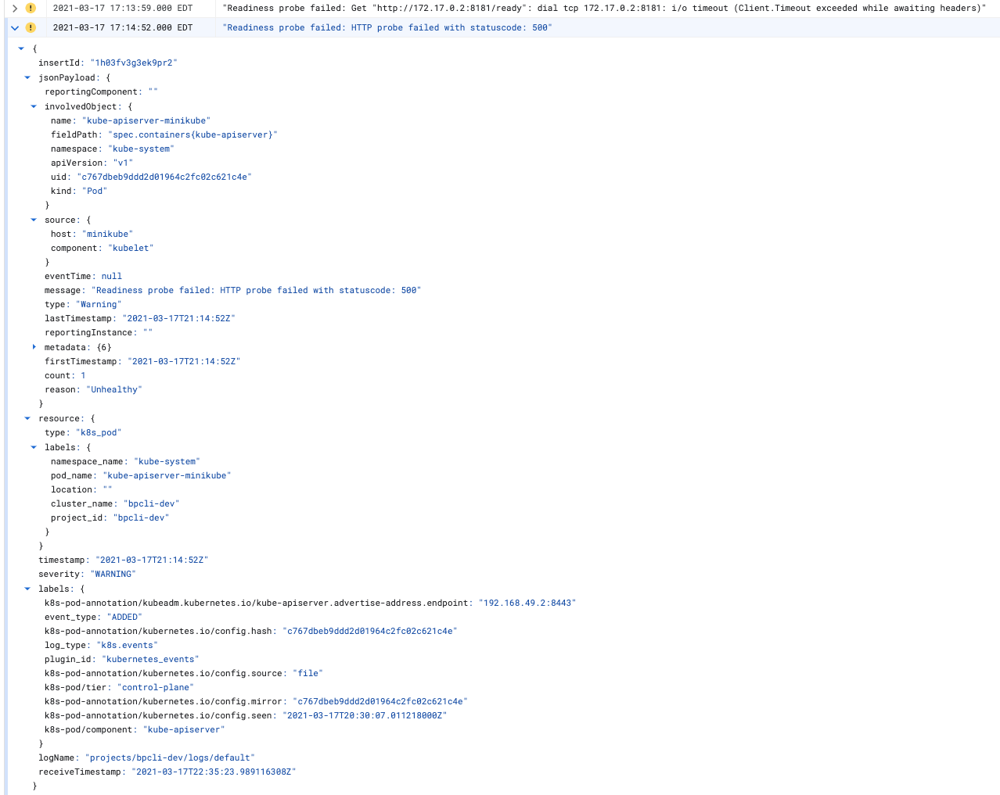

# Kubernetes Events w/ Google Cloud Logging

Stanza can be deployed as a Kubernetes Events collector by leveraging the [k8s_event_input](https://github.com/observIQ/stanza/blob/master/docs/operators/k8s_event_input.md) operator. [Minikube](https://minikube.sigs.k8s.io/docs/start/)
can be used for this example.

## Architecture

1. Service account with permission to the Kubernetes API server
2. Config map: Contains the stanza configuration file
3. Credentials secret: Contains Google Cloud [service account credentials JSON file](https://cloud.google.com/docs/authentication/getting-started)
4. Persistent volume: Allows the stanza database to persist between restarts and pod evictions
5. Deployment: A single replica deployment for the agent

## Prerequisites

1. Google Cloud account with Cloud Logging API enabled
2. Google service account with [roles/logging.logWriter](https://cloud.google.com/logging/docs/access-control)
3. Kubernetes Cluster with a storageclass capable of providing persistent volumes
4. Edit `config.yaml` to include:
  - Your cluster name (this is added as a label)
  - Your project_id

## Deployment Steps

Create the credentials secret. The file provided in this example should be replaced
with your service account's credentials.
```
kubectl create secret generic stanza-agent-credentials \
  --from-file=log_credentials.json
```

Create the Kubernetes Service Account
```
kubectl apply -f service_account.yaml
```

Create the config map
```
kubectl apply -f config.yaml
```

Deploy the agent
```
kubectl apply -f deployment.yaml
```

## Validate

Log into Google Cloud Logging


