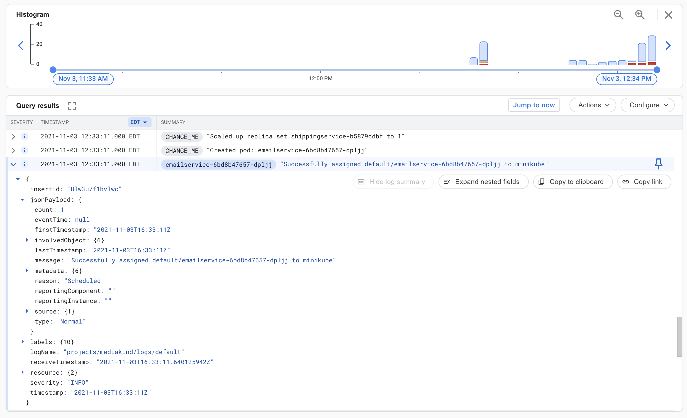

# Google Kubernetes Engine Logs and Events w/ Google Cloud Logging

Stanza can be deployed to Google Kubernetes Engine for log and event collection. Container logs
are gathered from each Kubernetes Node's filesystem. Events are collected from the Kubernetes
API Server.

## Architecture

1. Service account with permission to the Kubernetes API server
2. Config map: Contains the Stanza configurations
3. Persistent volume: Allows the Stanza events agent database to persist between restarts and pod evictions
4. Statefulset: A single replica statefulset for reading Kubernetes events
5. Daemonset: For reading logs from each Kubernetes node

## Prerequisites

1. Google Cloud account with Cloud Logging API enabled
2. Google GKE cluster with [write permission to cloud logging](https://developers.google.com/identity/protocols/oauth2/scopes#logging)
3. Edit `agent.yaml`'s configmap (at the top) to include:
  - Your cluster name: an arbitrary value that will be added to each log entry as a label

## Deployment Steps

Deploy Stanza
```bash
kubectl apply -f agent.yaml
```

## Validate

Log into Google Cloud Logging


