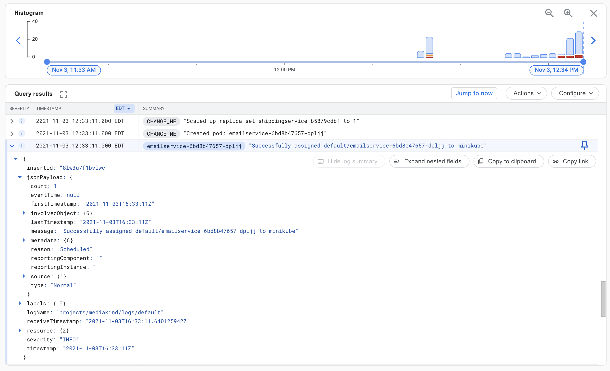

# Kubernetes On Prem Logs and Events w/ Google Cloud Logging

Stanza can be deployed to Kubernetes On Prem for log and event collection. Container logs
are gathered from each Kubernetes Node's filesystem. Events are collected from the Kubernetes
API Server.

## Architecture

1. Service account with permission to the Kubernetes API server
2. Config map: Contains the Stanza configurations
3. Credentials secret: Contains Google Cloud [service account credentials JSON file](https://cloud.google.com/docs/authentication/getting-started)
4. Persistent volume: Allows the Stanza events agent database to persist between restarts and pod evictions
5. Statefulset: A single replica statefulset for reading Kubernetes events
6. Daemonset: For reading logs from each Kubernetes node

## Prerequisites

1. Google Cloud account with Cloud Logging API enabled
2. Google service account with [roles/logging.logWriter](https://cloud.google.com/logging/docs/access-control)
3. Kubernetes Cluster with a storageclass capable of providing persistent volumes
4. Edit `agent.yaml`'s configmap (at the top) to include:
  - Your cluster name: an arbitrary value that will be added to each log entry as a label

## Deployment Steps

Create the credentials secret. Download your Google service accounts JSON key and name it `log_credentials.json`.
**NOTE**: The file name `log_credentials.json` is required, as that will be the name of the key that is referenced 
when mounting the secret.
```bash
kubectl create secret generic stanza-agent-credentials \
  --from-file=log_credentials.json
```

Deploy Stanza
```bash
kubectl apply -f agent.yaml
```

## Validate

Log into Google Cloud Logging


