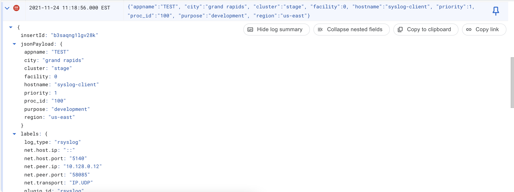

# Rsyslog Forwarding

It is possible to configure client systems' Rsyslog service to forward syslog to a remote
Stanza agent by leveraging the Rsyslog plugin.

## Architecture

- One or more Linux systems with [rsyslog forwarding](https://www.rsyslog.com/sending-messages-to-a-remote-syslog-server/) configured:
  - Forward to the Stanza VM's IP address on port 5140 UDP
- One Stanza VM with the [config](./config.yaml) in this directory
- Handle custom parsing by leveraging the [json parser](https://github.com/observIQ/stanza/blob/master/docs/operators/json_parser.md) and [move](https://github.com/observIQ/stanza/blob/master/docs/operators/move.md) operators
- Output to Google Cloud Logging

## Goals

1. Handle rfc 3164 from remote rsyslog clients
2. Parse message field as json, if we detect json, else go to google
3. Rename the locaiton field --> city
4. Send parsed logs to Google

## Usage

1. Copy the configuration file in this directory to your Stanza agent at `/opt/observiq/stanza/config.yaml`
2. Restart Stanza: `systemctl restart stanza`
3. [Configure your Rsyslog](https://www.rsyslog.com/sending-messages-to-a-remote-syslog-server/) clients to forward messages to Stanza's IP on port 5140/udp
4. Restart Rsyslog and generate logs using the [logger command](https://www.networkworld.com/article/3274570/using-logger-on-linux.html)

You can send an example message using Net Cat. Be sure to update the ip address and timestamp. Notice how stanza parses the json message field.

```bash
echo '<1>Nov 24 16:18:56 syslog-client TEST[100]: {"region": "us-east", "cluster": "stage", "purpose":"development", "location":"grand rapids"}' | nc -u 10.128.0.11 5140
```


